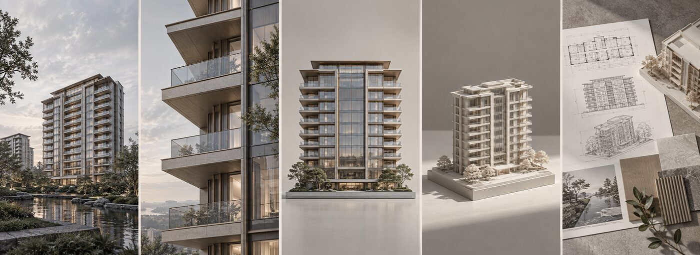
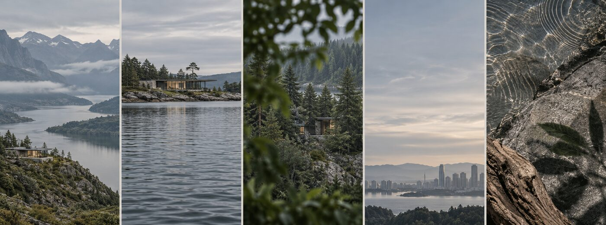
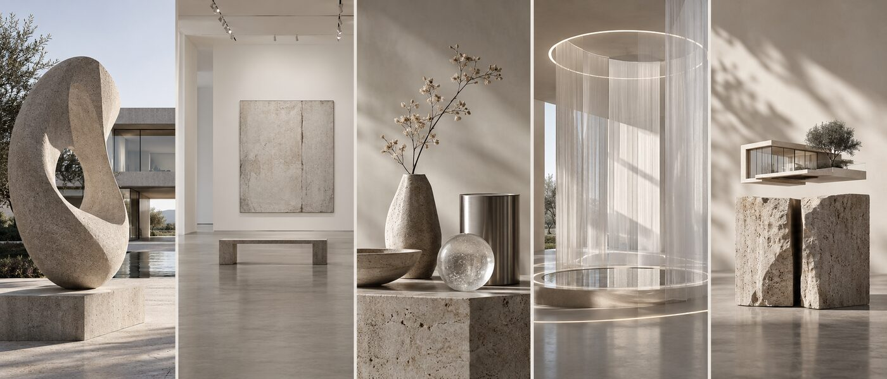
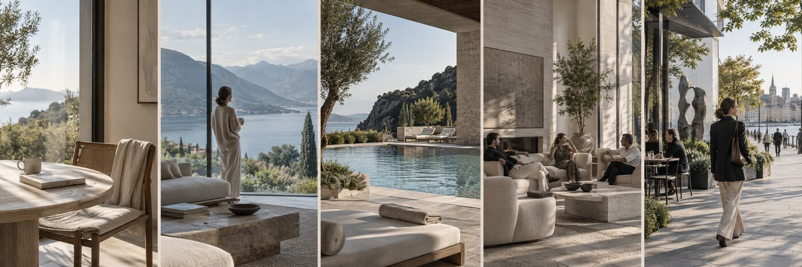
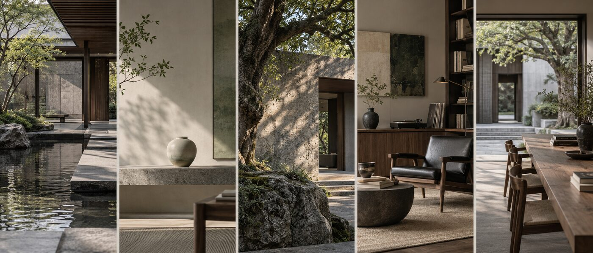
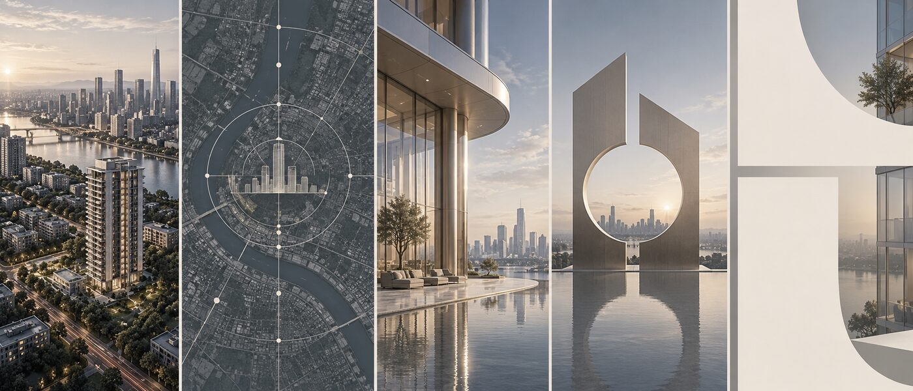

# 地产广告设计助手

一个面向中国房地产营销场景的 AI Skill，将模糊需求转化为设计师可直接起稿、AI 图像平台可直接执行的视觉方案。

它不是“地产提示词合集”，而是一套包含任务判断、素材保真、创意方向、视觉母题、趋势检索、合规检查和设计质检的完整工作流。

## 能解决什么

- 地产主视觉 / KV、案名发布、品牌预热
- 建筑、景观、会所、户型与服务价值海报
- 大师人物、地块区位、航拍与真实素材合成
- 喜报、获奖、战报、通知和公告
- 已有 Campaign 的系列延展
- 现稿诊断，以及“不够贵、太地产、太 AI”等模糊反馈翻译

## 核心特点

- **先给首稿判断**：信息足够时直接提出方案，不用十几道问题阻塞用户。
- **默认三套真差异方案**：不仅换颜色，而是改变第一视觉、构图、媒介感或叙事机制。
- **画面描述足够具体**：明确主体位置、占比、镜头、光线、色彩、材质、排版与后期。
- **保护真实素材**：建筑、人物、区位、奖项和正式 Logo 分层锁定，避免生成模型篡改事实。
- **内置质量门**：视觉具体度低于 88 分自动重写，并执行抽象词、重建、方案差异和营销有效性检查。
- **兼顾广告合规**：结合语境和证据检查绝对化用语、数据、区位、规划、效果图、肖像与版权风险。

## 视觉知识库

Skill 内置 30 个视觉母题，并配置 6 张原创参考板。













原创参考板覆盖：建筑宣言、建筑切片、建筑模型、巨幅自然、水岸静境、森林隐居、艺术展览、光影装置、生活方式、当代东方、时间、城市坐标、未来建筑、品牌超级符号、Typography First 等方向。

## 案例与趋势研究

仓库不预置固定真实项目名单。需要案例或趋势参考时，Skill 会按知识库中的采集字段、分类体系和评分模型检索当前资料，并将案例提炼为可迁移的视觉机制。

## 目录结构

```text
real-estate-ad-design-skill/
├── SKILL.md
├── agents/
│   └── openai.yaml
├── assets/
│   └── reference-boards/
│       ├── m01-m05-architecture.jpg
│       ├── m06-m10-nature.jpg
│       ├── m11-m15-art.jpg
│       ├── m16-m20-lifestyle.jpg
│       ├── m21-m25-eastern-legacy.jpg
│       └── m26-m30-city-brand.jpg
└── references/
    ├── 案例与趋势知识库.md
    └── 视觉母题与执行知识库.md
```

## 使用方法

将完整目录作为 Skill 安装或复制到支持 `SKILL.md` 的智能体技能目录中，然后直接描述项目资料。

示例：

```text
使用地产广告设计助手，为一个城市滨水改善住宅做案名发布KV。
已有建筑效果图和项目Logo，不要黑金，不要大面积蓝天水面。
请直接给三套能让设计师起稿的方案。
```

也可以上传现有海报：

```text
使用地产广告设计助手诊断这张海报。
领导反馈“不够贵、楼太小”，请把反馈翻译成具体修改动作。
```

## 输出内容

每套正式方案通常包括：

- 方向名称、推荐度与推荐理由
- 一眼画面、第一视觉与第二视觉
- 前景、中景、背景与主体占比
- 画幅、构图、视角、镜头和焦段
- 光线、色彩、材质、建筑、人物与环境
- 标题层级、字体倾向、Logo 与二维码安全区
- 后期动作、禁止项、AI 易错项
- 推荐生产流程与 AI 执行 Prompt
- 合规及待确认事实

## 设计原则

- 不默认“豪宅等于黑金”。
- 不默认“东方等于水墨、祥云、鹤和印章”。
- 不默认“服务等于员工排队微笑”。
- 不默认“大师等于论坛嘉宾海报”。
- 不让 AI 重绘正式 Logo。
- 不用空泛的“高级、国际、艺术、松弛”替代视觉动作。
- 不编造建筑、区位、规划、奖项、销量与排名事实。

## 版权说明

- `SKILL.md`、文字知识库和原创母题参考板按本项目许可证使用。
- 临时检索到的第三方案例、图片、项目名称和品牌资产不在本项目许可范围内。
- 使用外部案例时请保留来源，并遵守原作者与发布平台的许可要求。
- 本项目提供设计工作流与研究参考，不构成法律意见。

## License

MIT License。第三方图片及品牌资产除外，详见 [THIRD_PARTY_NOTICES.md](THIRD_PARTY_NOTICES.md)。
